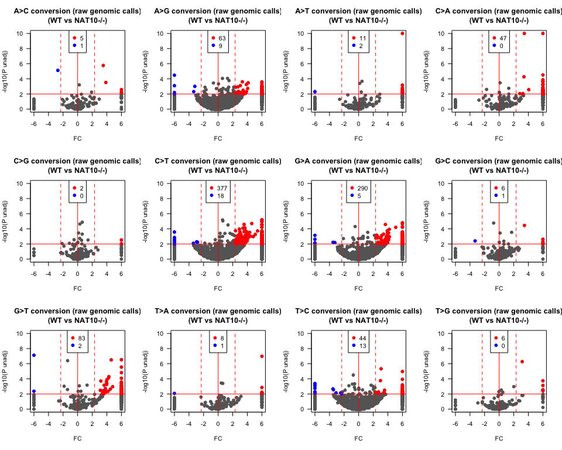
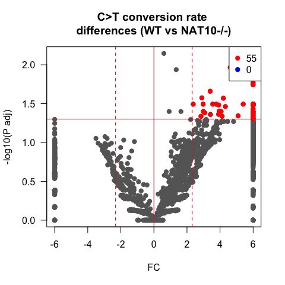
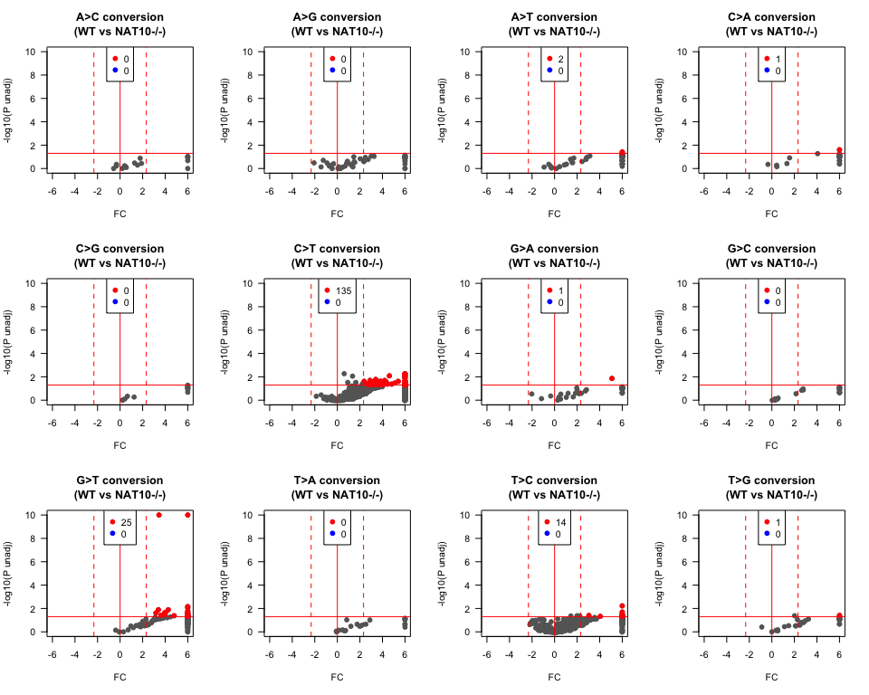
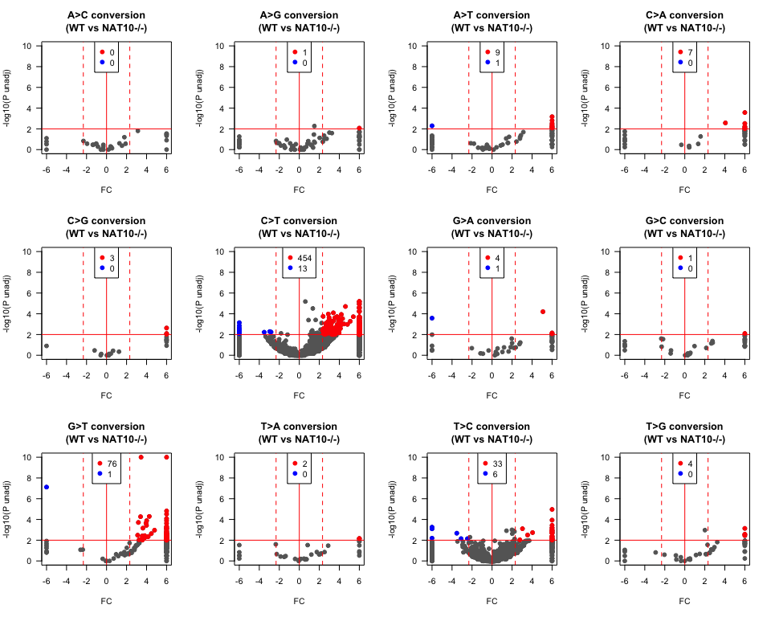
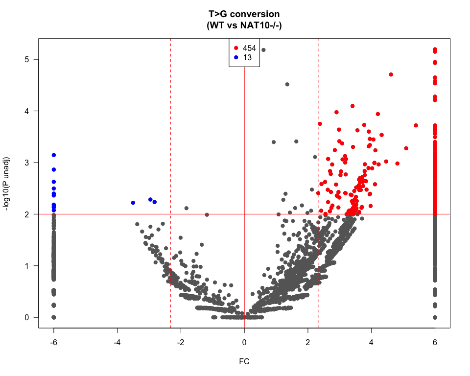
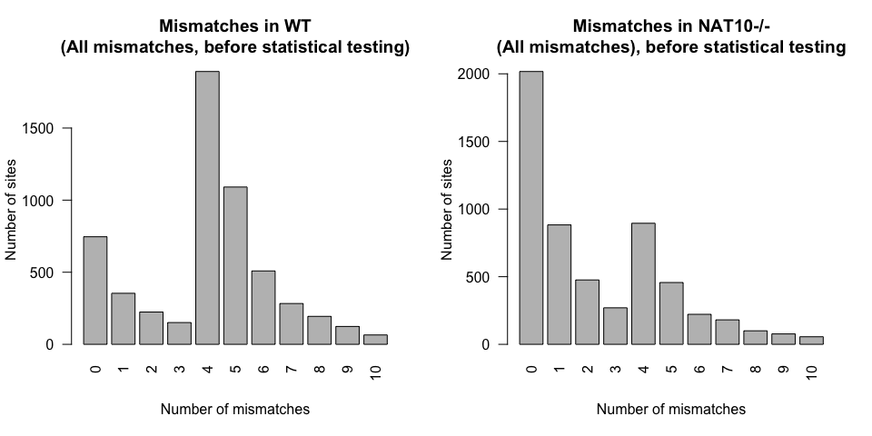
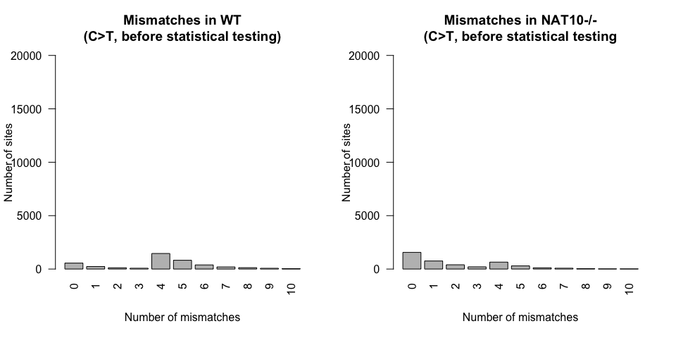

RedaCT-Seq
================
Dave
2022-07-28

``` r
####################################
# Column order for the data:
####################################

# WT NaBH4
# KO NaBH4
# WT Untreated control

####################################
# Process all mismatches
####################################
pileup <- fread('sampledata/mpileup_output_chr19_min10_parsed.txt')
nrow(pileup)
```

    ## [1] 9215793

``` r
#~~~~~~~~~~~~~~~~~~~~~~~~~~~~~~~~~
# Optional filter 
## Reduce to locations on primary assembly 
#~~~~~~~~~~~~~~~~~~~~~~~~~~~~~~~~~
mychrs <- c(paste0("chr",seq(1,22,1)),"chrX")
pileup <- pileup %>% filter(chr %in% mychrs)

#~~~~~~~~~~~~~~~~~~~~~~~~~~~~~~~~~
#~~~~~~~~~~~~~~~~~~~~~~~~~~~~~~~~~

# Get mismatch percentages
All.ref <- data.frame(pileup[, c(1:13)], mis_WT_NaBH4=with(pileup, (Sub_0)/(depth_0)), mis_KO_NaBH4=with(pileup, (Sub_1)/(depth_1)), mis_WT_Ctrl=with(pileup, (Sub_2)/(depth_2)),mis_WT_Ctrl_total=with(pileup, ((depth_2) - (Ref_2))/(depth_2)))

#Get ratio between samples
All.ref <- data.frame(All.ref[, c(1:17)], WT_KO_NaBH4_ratio=with(All.ref, mis_WT_NaBH4/mis_KO_NaBH4), WT_WT_Ctrl_ratio=with(All.ref, mis_WT_NaBH4/mis_WT_Ctrl), KO_WT_NaBH4_ratio=with(All.ref, mis_KO_NaBH4/mis_WT_NaBH4))

head(All.ref)
```

    ##     chr   loc ref sub depth_0 Ref_0 Sub_0 depth_1 Ref_1 Sub_1 depth_2 Ref_2
    ## 1 chr19 60745   T   A      10    10     0      10    10     0      18    18
    ## 2 chr19 60745   T   C      10    10     0      10    10     0      18    18
    ## 3 chr19 60745   T   G      10    10     0      10    10     0      18    18
    ## 4 chr19 60746   C   A      10    10     0      10    10     0      17    17
    ## 5 chr19 60746   C   T      10    10     0      10    10     0      17    17
    ## 6 chr19 60746   C   G      10    10     0      10    10     0      17    17
    ##   Sub_2 mis_WT_NaBH4 mis_KO_NaBH4 mis_WT_Ctrl mis_WT_Ctrl_total
    ## 1     0            0            0           0                 0
    ## 2     0            0            0           0                 0
    ## 3     0            0            0           0                 0
    ## 4     0            0            0           0                 0
    ## 5     0            0            0           0                 0
    ## 6     0            0            0           0                 0
    ##   WT_KO_NaBH4_ratio WT_WT_Ctrl_ratio KO_WT_NaBH4_ratio
    ## 1               NaN              NaN               NaN
    ## 2               NaN              NaN               NaN
    ## 3               NaN              NaN               NaN
    ## 4               NaN              NaN               NaN
    ## 5               NaN              NaN               NaN
    ## 6               NaN              NaN               NaN

``` r
dim(All.ref)
```

    ## [1] 9215793      20

``` r
# Preserve the unfiltered object under
# a different name so you can go back to it.
# All.ref.unfiltered <- All.ref

#~~~~~~~~~~~~~~~~~~~~~~~~~~~~~~~~~~~~~~~~~~~~~~~
#~~~~~~~~~~~~~~~~~~~~~~~~~~~~~~~~~~~~~~~~~~~~~~~
# Apply some filters
#~~~~~~~~~~~~~~~~~~~~~~~~~~~~~~~~~~~~~~~~~~~~~~~
#~~~~~~~~~~~~~~~~~~~~~~~~~~~~~~~~~~~~~~~~~~~~~~~

# Depth at least 10 in WT AND KO AND Untreated
All.ref <- All.ref %>% filter(depth_0 >= 10 & depth_1 >= 10 & depth_2 >= 10)
dim(All.ref)
```

    ## [1] 9215793      20

``` r
#Filter coverage in Substitute  base for > 4 in either treated sample
All.ref <- All.ref %>% filter(Sub_0 >= 4 | Sub_1 >= 4)
dim(All.ref)
```

    ## [1] 73417    20

``` r
#Filter by mismatch fraction >= 1% in either treated sample
All.ref <- All.ref %>% filter(mis_WT_NaBH4 >= 0.01 | mis_KO_NaBH4 >= 0.01)
dim(All.ref)
```

    ## [1] 18802    20

``` r
#~~~~~~~~~~~~~~~~~~~~~~~~~~~~~~~~~~~~~~~~~~~~~~~
#~~~~~~~~~~~~~~~~~~~~~~~~~~~~~~~~~~~~~~~~~~~~~~~
# Obtain ac4C candidate sites ( in balanced fashion (KO and WT))
#~~~~~~~~~~~~~~~~~~~~~~~~~~~~~~~~~~~~~~~~~~~~~~~
#~~~~~~~~~~~~~~~~~~~~~~~~~~~~~~~~~~~~~~~~~~~~~~~
Combined.ref.allmm <- All.ref

#~~~~~~~~~~~~~~~~~~~~~~~~
# Append consistent identifiers
#~~~~~~~~~~~~~~~~~~~~~~~~

Combined.ref.allmm$locID <- paste0(Combined.ref.allmm$chr,":",Combined.ref.allmm$loc)
Combined.ref.allmm$subID <- paste0(Combined.ref.allmm$chr,":",Combined.ref.allmm$loc,":",Combined.ref.allmm$ref,">",Combined.ref.allmm$sub)

#~~~~~~~~~~~~~~~~~~~~~~~~
# Save objects (optional)
#~~~~~~~~~~~~~~~~~~~~~~~~

#dim(Combined.ref.allmm)
#save(Combined.ref.allmm, file="Combined.ref.allmm.Rdata")

# These are optional to save for diagnostics
#save(All.ref.unfiltered, file="Robjects/All.ref.unfiltered.Rdata")
#save(Combined.ref.CT, file="Robjects/Combined.ref.CT_pooled.Rdata")
```

# Diagnostics

## Exploring mismatch profiels before resolving stand

## or performing any filtering

``` r
Combined.ref.allmm$Fisher_WT_KO_BH4 = NA
for(i in 1:length(Combined.ref.allmm$chr)){
  Combined.ref.allmm$Fisher_WT_KO_BH4[i] = fisher.test(matrix(c(Combined.ref.allmm$Sub_0[i],Combined.ref.allmm$Ref_0[i],Combined.ref.allmm$Sub_1[i],Combined.ref.allmm$Ref_1[i]), nrow=2))$p.value
}

Combined.ref.allmm$genomic_conversion <- paste0(Combined.ref.allmm$ref,">",Combined.ref.allmm$sub)

conv_tab <- table(Combined.ref.allmm$genomic_conversion)
conv_tab[order(conv_tab)]
```

    ## 
    ##  A>C  A>T  T>A  T>G  C>G  G>C  C>A  G>T  T>C  G>A  A>G  C>T 
    ##  221  230  230  246  311  335  458  546 3282 3898 3965 5080

``` r
myconvs <- names(conv_tab)

# Set cutoff

myp <- 0.01
myratio <- 5

op <- par(mfrow = c(3,4))
for (i in 1:length(myconvs)) {
  
  myconv <- myconvs[i]
  myset <- Combined.ref.allmm[Combined.ref.allmm$genomic_conversion %in% myconv,]
  
  
  myx <- log2(myset$WT_KO_NaBH4_ratio)
    myy <- -log10(myset$Fisher_WT_KO_BH4)
    myy[myy >= 10] <- 10
    myx[myx >= 6] <- 6
    myy[myy <= -10] <- -10
    myx[myx <= -6] <- -6

    # Get the sigs
    mysig.wt <- myset[myset$Fisher_WT_KO_BH4 <= myp & myset$WT_KO_NaBH4_ratio >= myratio,]
    #mysig.wt.ct <- mysig.wt[mysig.wt$conversion == "C>T",]
    myx.wt <- log2(mysig.wt$WT_KO_NaBH4_ratio)
    myy.wt <- -log10(mysig.wt$Fisher_WT_KO_BH4)

    #mysig.ko <- myset[myset$Fisher_WT_KO_BH4 <= myp & myset$WT_KO_NaBH4_ratio <= (1/myratio),]
    mysig.ko <- myset[myset$Fisher_WT_KO_BH4 <= myp & myset$KO_WT_NaBH4_ratio >= myratio,]
    #mysig.ko.ct <- mysig.ko[mysig.ko$conversion == "C>T",]
    myx.ko <- log2(mysig.ko$WT_KO_NaBH4_ratio)
    myy.ko <- -log10(mysig.ko$Fisher_WT_KO_BH4)

    myy.wt[myy.wt >= 10] <- 10
    myx.wt[myx.wt >= 6] <- 6
    myy.wt[myy.wt <= -10] <- -10
    myx.wt[myx.wt <= -6] <- -6

    myy.ko[myy.ko >= 10] <- 10
    myx.ko[myx.ko >= 6] <- 6
    myy.ko[myy.ko <= -10] <- -10
    myx.ko[myx.ko <= -6] <- -6  
    #~~~~~~~~~~~~~~~~~~~~~
    # Color coding by sig
    #~~~~~~~~~~~~~~~~~~~~~
    plot(myx,myy,main=paste0(myconv,
    " conversion (raw genomic calls)\n(WT vs NAT10-/-)"),xlab="FC",ylab="-log10(P unadj)",col="grey40",las=1,xlim=c(-6,6),ylim=c(0,10),pch=19)
    points(myx.wt,myy.wt,col="red",pch=19)
    points(myx.ko,myy.ko,col="blue",pch=19)
    abline(v=0,col="red",lwd=1)
    abline(v=log2(myratio),col="red",lwd=1,lty=2)   
    abline(v=log2(1/myratio),col="red",lwd=1,lty=2) 
    abline(h=-log10(myp),col="red",lwd=1)   
    legend("top",c(as.character(length(myx.wt)),as.character(length(myx.ko))),pch=19,col=c("red","blue"))
}
```

<!-- -->

``` r
par(op)
```

# Librarys for conversion for tx space

``` r
library('rtracklayer')
```

    ## Loading required package: GenomicRanges

    ## Loading required package: stats4

    ## Loading required package: BiocGenerics

    ## Loading required package: parallel

    ## 
    ## Attaching package: 'BiocGenerics'

    ## The following objects are masked from 'package:parallel':
    ## 
    ##     clusterApply, clusterApplyLB, clusterCall, clusterEvalQ,
    ##     clusterExport, clusterMap, parApply, parCapply, parLapply,
    ##     parLapplyLB, parRapply, parSapply, parSapplyLB

    ## The following objects are masked from 'package:dplyr':
    ## 
    ##     combine, intersect, setdiff, union

    ## The following objects are masked from 'package:stats':
    ## 
    ##     IQR, mad, sd, var, xtabs

    ## The following objects are masked from 'package:base':
    ## 
    ##     anyDuplicated, append, as.data.frame, basename, cbind, colnames,
    ##     dirname, do.call, duplicated, eval, evalq, Filter, Find, get, grep,
    ##     grepl, intersect, is.unsorted, lapply, Map, mapply, match, mget,
    ##     order, paste, pmax, pmax.int, pmin, pmin.int, Position, rank,
    ##     rbind, Reduce, rownames, sapply, setdiff, sort, table, tapply,
    ##     union, unique, unsplit, which.max, which.min

    ## Loading required package: S4Vectors

    ## 
    ## Attaching package: 'S4Vectors'

    ## The following objects are masked from 'package:dplyr':
    ## 
    ##     first, rename

    ## The following objects are masked from 'package:data.table':
    ## 
    ##     first, second

    ## The following objects are masked from 'package:base':
    ## 
    ##     expand.grid, I, unname

    ## Loading required package: IRanges

    ## 
    ## Attaching package: 'IRanges'

    ## The following objects are masked from 'package:dplyr':
    ## 
    ##     collapse, desc, slice

    ## The following object is masked from 'package:data.table':
    ## 
    ##     shift

    ## Loading required package: GenomeInfoDb

``` r
library('GenomicFeatures')
```

    ## Loading required package: AnnotationDbi

    ## Loading required package: Biobase

    ## Welcome to Bioconductor
    ## 
    ##     Vignettes contain introductory material; view with
    ##     'browseVignettes()'. To cite Bioconductor, see
    ##     'citation("Biobase")', and for packages 'citation("pkgname")'.

    ## 
    ## Attaching package: 'AnnotationDbi'

    ## The following object is masked from 'package:dplyr':
    ## 
    ##     select

``` r
library('genomation')
```

    ## Loading required package: grid

    ## Warning: replacing previous import 'Biostrings::pattern' by 'grid::pattern' when
    ## loading 'genomation'

``` r
#library('readxl')
library('stringr')
```

``` r
#Genomic_candidates <- Combined.ref.allmm[Combined.ref.allmm$Fisher_WT_KO_BH4 <= 0.05,]
mysites <- Combined.ref.allmm
mybed <- data.frame(chr = mysites$chr,start = format(mysites$loc - 1,scientific=F) ,end = format(mysites$loc,scientific=F),id = mysites$subID,score = 1,strand = "*")
mybed$start <- str_trim(mybed$start, side = "both")
mybed$end <- str_trim(mybed$end, side = "both")
write.table(mybed,file="genomicsites.bed",col.names=F,quote=F,row.names=F,sep="\t")
```

``` r
NaBH4sites <- Combined.ref.allmm
mybed <- genomation::readBed("genomicsites.bed")
```

    ## Rows: 2 Columns: 6
    ## ── Column specification ────────────────────────────────────────────────────────
    ## Delimiter: "\t"
    ## chr (3): X1, X4, X6
    ## dbl (3): X2, X3, X5
    ## 
    ## ℹ Use `spec()` to retrieve the full column specification for this data.
    ## ℹ Specify the column types or set `show_col_types = FALSE` to quiet this message.

``` r
#mybed <- genomation::readBed("BED/genomicsites_allmm_pool_1percent_KO_birectional_balanced.bed",track.line=FALSE)
# Note I do this (write out bed, reload in bed) because its the only way I know to get in genomation format

dim(mybed)
```

    ## NULL

``` r
mytxcanon <- rtracklayer::import("sampledata/genes_chr19.gtf")
myTxDbcanon <- makeTxDbFromGRanges(mytxcanon)

exon_by_tx_canon <- exonsBy(myTxDbcanon, by="tx", use.names=TRUE)
mapped_exon_canon <- mapToTranscripts(mybed, exon_by_tx_canon,ignore.strand=FALSE)


#~~~~~~~~~~~~~~~~~~
# Tabulate feature lengths
#~~~~~~~~~~~~~~~~~

transcriptInfo <- transcriptLengths(myTxDbcanon, with.cds_len=TRUE,
                  with.utr5_len=TRUE, with.utr3_len=TRUE)


gr <-  mapped_exon_canon       
query.idx <- mcols(mapped_exon_canon)[,1] 
query.ids <- mcols(mybed)[,2]
query.sites <- query.ids[query.idx]
length(query.sites)
```

    ## [1] 12281

``` r
df <- data.frame(seqnames=seqnames(gr),
  starts=start(gr)-1,
  ends=end(gr),
  names=c(rep(".", length(gr))),
  scores=c(rep(".", length(gr))),
  strand=strand(gr),
  subID = query.sites)


#~~~~~~~~~~~~~~
# Adding annotation, feature location
#~~~~~~~~~~~~~~
        
df$txlength <- transcriptInfo$tx_len[match(df$seqnames,transcriptInfo$gene_id)]        
df$UTR5length <- transcriptInfo$utr5_len[match(df$seqnames,transcriptInfo$gene_id)]        
df$CDSlength <- transcriptInfo$cds_len[match(df$seqnames,transcriptInfo$gene_id)]        
df$UTR3length <- transcriptInfo$utr3_len[match(df$seqnames,transcriptInfo$gene_id)]        

myfeatures <- NULL
myfeatureposs <- NULL

for (i in 1:nrow(df)) {

        myrow <- df[i,]
        mypos <- myrow$starts
        if (myrow$CDSlength < 1) {
          myfeature = "none"
          myfeatures <- c(myfeatures,myfeature)
          myfeatureposs <- c(myfeatureposs,mypos)
        } else {
                    if (mypos <= myrow$UTR5length) { myfeature = "UTR5" }
                    if (mypos > myrow$UTR5length & mypos <= (myrow$UTR5length + myrow$CDSlength)) { myfeature = "CDS" }
                    if (mypos > (myrow$UTR5length + myrow$CDSlength)) { myfeature = "UTR3" }      
                    myfeatures <- c(myfeatures,myfeature)
                    if (myfeature == "UTR5") { myfeaturepos <- mypos }        
                    if (myfeature == "CDS") { myfeaturepos <- mypos - myrow$UTR5length }        
                    if (myfeature == "UTR3") { myfeaturepos <- mypos - myrow$UTR5length - myrow$CDSlength }           
                    myfeatureposs <- c(myfeatureposs,myfeaturepos)
                }
}
 
df$feature <- myfeatures
df$feature_pos <- myfeatureposs

table(df$feature)
```

    ## 
    ##  CDS none UTR3 UTR5 
    ## 7443  189 4053  596

``` r
prop.table(table(df$feature))
```

    ## 
    ##        CDS       none       UTR3       UTR5 
    ## 0.60605814 0.01538963 0.33002199 0.04853025

``` r
df$pos_rel_aTIS <- df$starts - df$UTR5length
df$pos_rel_aTIS[df$feature == "none"] <- NA
df$feature_pos[df$feature == "none"] <- NA
#~~~~~~~~~~~~~~~~
# Correct the strand etc
#~~~~~~~~~~~~~~~~~

NaBH4_join <- left_join(df,NaBH4sites,by="subID")

NaBH4_join$ref_strandcorrect <- NaBH4_join$ref
NaBH4_join$sub_strandcorrect <- NaBH4_join$sub

NaBH4_join$ref_strandcorrect[NaBH4_join$strand == "-" & NaBH4_join$ref == "C"] <- "G"
NaBH4_join$ref_strandcorrect[NaBH4_join$strand == "-" & NaBH4_join$ref == "G"] <- "C"
NaBH4_join$ref_strandcorrect[NaBH4_join$strand == "-" & NaBH4_join$ref == "A"] <- "T"
NaBH4_join$ref_strandcorrect[NaBH4_join$strand == "-" & NaBH4_join$ref == "T"] <- "A"

NaBH4_join$sub_strandcorrect[NaBH4_join$strand == "-" & NaBH4_join$sub == "C"] <- "G"
NaBH4_join$sub_strandcorrect[NaBH4_join$strand == "-" & NaBH4_join$sub == "G"] <- "C"
NaBH4_join$sub_strandcorrect[NaBH4_join$strand == "-" & NaBH4_join$sub == "A"] <- "T"
NaBH4_join$sub_strandcorrect[NaBH4_join$strand == "-" & NaBH4_join$sub == "T"] <- "A"

NaBH4_join$conversion <- paste0(NaBH4_join$ref_strandcorrect,">",NaBH4_join$sub_strandcorrect)

prop.table(table(NaBH4_join$conversion[NaBH4_join$strand == "+"])) * 100
```

    ## 
    ##        A>C        A>G        A>T        C>A        C>G        C>T        G>A 
    ##  0.9252960 10.1102191  1.4968023  0.8980814  1.0069397 56.8512723  3.8916859 
    ##        G>C        G>T        T>A        T>C        T>G 
    ##  1.1157981  4.3951558  0.8572595 17.5125867  0.9389033

``` r
prop.table(table(NaBH4_join$conversion[NaBH4_join$strand == "-"])) * 100
```

    ## 
    ##        A>C        A>G        A>T        C>A        C>G        C>T        G>A 
    ##  1.1759935  5.6163828  1.3787510  1.5004055  1.3787510 60.4420114  4.4606650 
    ##        G>C        G>T        T>A        T>C        T>G 
    ##  1.3990268  4.6634225  0.4663423 16.5044607  1.0137875

``` r
table(NaBH4_join$conversion)
```

    ## 
    ##  A>C  A>G  A>T  C>A  C>G  C>T  G>A  G>C  G>T  T>A  T>C  T>G 
    ##  126 1020  178  140  142 7159  506  151  553   86 2101  119

``` r
prop.table(table(NaBH4_join$conversion))
```

    ## 
    ##         A>C         A>G         A>T         C>A         C>G         C>T 
    ## 0.010259751 0.083055126 0.014493934 0.011399723 0.011562576 0.582932986 
    ##         G>A         G>C         G>T         T>A         T>C         T>G 
    ## 0.041201857 0.012295416 0.045028906 0.007002687 0.171077274 0.009689765

``` r
#~~~~~~~~~~~~~~~~~~~~~~~
# How many have ambiguous mapping to transcripts?
#~~~~~~~~~~~~~~~~~~~~~~

maptab <- table(NaBH4_join$subID)
ambiguous_map <- names(maptab[maptab > 1])
length(ambiguous_map)
```

    ## [1] 292

``` r
table(NaBH4_join$conversion[NaBH4_join$subID %in% ambiguous_map])
```

    ## 
    ## A>C A>G A>T C>A C>G C>T G>A G>C G>T T>A T>C T>G 
    ##   6  26   7  11   8 301 105   4  23   3  86   4

``` r
#~~~~~~~~~~~~~~~~~~~~~~~
# How many have more than one substitution type?
#~~~~~~~~~~~~~~~~~~~~~~

# Get the table of unique subID and locID pairs
# Find locID (genomic locations) that > 1 subID (substitutions)

testtab <- unique(NaBH4_join[,c("subID","locID")])
multiple_sub_tab <- table(testtab$locID)
multiple_subs <- names(multiple_sub_tab[multiple_sub_tab > 1])


#~~~~~~~~~~~~~~~~~~~~~~~
#~~~~~~~~~~~~~~~~~~~~~~~
# Filter ambiguous mapping or mulitple subs
#~~~~~~~~~~~~~~~~~~~~~~
#~~~~~~~~~~~~~~~~~~~~~~~

NaBH4_join_filter <- NaBH4_join %>% filter(!(subID %in% ambiguous_map))
NaBH4_join_filter <- NaBH4_join_filter %>% filter(!(locID %in% multiple_subs))

# testing filter
table(NaBH4_join$subID %in% ambiguous_map)
```

    ## 
    ## FALSE  TRUE 
    ## 11697   584

``` r
table(NaBH4_join$locID %in% multiple_subs)
```

    ## 
    ## FALSE  TRUE 
    ## 12267    14

``` r
table(NaBH4_join_filter$conversion)
```

    ## 
    ##  A>C  A>G  A>T  C>A  C>G  C>T  G>A  G>C  G>T  T>A  T>C  T>G 
    ##  118  993  170  129  133 6857  400  145  529   83 2013  113

``` r
prop.table(table(NaBH4_join_filter$conversion))
```

    ## 
    ##         A>C         A>G         A>T         C>A         C>G         C>T 
    ## 0.010100146 0.084995292 0.014551057 0.011041684 0.011384062 0.586921168 
    ##         G>A         G>C         G>T         T>A         T>C         T>G 
    ## 0.034237781 0.012411196 0.045279466 0.007104340 0.172301635 0.009672173

``` r
barplot(table(NaBH4_join_filter$conversion),las=2,main="Substitutions in unfiltered sites")
```

<!-- -->

``` r
#~~~~~~~~~~~~~~~~~~~~~~~~~~~~~~~~~~~~~~~~~~~~~~~~~~~~~~~
#~~~~~~~~~~~~~~~~~~~~~~~~~~~~~~~~~~~~~~~~~~~~~~~~~~~~~~~
# Save the results
#~~~~~~~~~~~~~~~~~~~~~~~~~~~~~~~~~~~~~~~~~~~~~~~~~~~~~~
#~~~~~~~~~~~~~~~~~~~~~~~~~~~~~~~~~~~~~~~~~~~~~~~~~~~~~~~
dim(NaBH4_join_filter)
```

    ## [1] 11683    40

``` r
dim(NaBH4_join)
```

    ## [1] 12281    40

``` r
NaBH4_join_allmm_pool <- NaBH4_join_filter
dim(NaBH4_join_allmm_pool)
```

    ## [1] 11683    40

``` r
save(NaBH4_join_allmm_pool,file="NaBH4_join_allmm_txmapped.Rdata")    
```

# Load the object for prototyping below

``` r
print(load(file="NaBH4_join_allmm_txmapped.Rdata"))
```

# Filter and get candidates

``` r
#~~~~~~~~~~~~~~~~~~~~~~~~~~~
#~~~~~~~~~~~~~~~~~~~~~~~~~~~~
# Get data for just 1.25%
#~~~~~~~~~~~~~~~~~~~~~~~~~~~
#~~~~~~~~~~~~~~~~~~~~~~~~~~~

#~~~~~~~~~~~~~~~~~~~~~~~~~~~
#~~~~~~~~~~~~~~~~~~~~~~~~~~~~
# Get candidates that pass comparison to untreated
#~~~~~~~~~~~~~~~~~~~~~~~~~~~
#~~~~~~~~~~~~~~~~~~~~~~~~~~~

#`````````````````````````````
# Increase minimum depth for comparison to untreated
# Coverage in Untreated >= 25
#`````````````````````````````

mycandidates <- NaBH4_join_allmm_pool[NaBH4_join_allmm_pool$depth_2 >= 25 & !(is.na(NaBH4_join_allmm_pool$depth_2)),]


#~~~~~~~~~~~~~~
# Add more fields for diagnostics
#~~~~~~~~~~~~~~
mycandidates$diffMM <- mycandidates$mis_WT_NaBH4 - mycandidates$mis_KO_NaBH4
mycandidates$mean_NaBH4_depth <- (mycandidates$depth_0 + mycandidates$depth_1) / 2
mycandidates$max_NaBH4_MM <- apply(mycandidates[,c("mis_KO_NaBH4","mis_WT_NaBH4")],1,max)
mycandidates$Perc_max_MM_lost <- (mycandidates$max_NaBH4_MM - mycandidates$mis_WT_Ctrl)/mycandidates$max_NaBH4_MM

#`````````````````````````````
# 90% mismatches lost
# This is balanced for WT/KO - takes the maximum of either
#`````````````````````````````
prop.table(table(mycandidates$Perc_max_MM_lost > 0.90))
```

    ## 
    ##     FALSE      TRUE 
    ## 0.2317192 0.7682808

``` r
mycandidates <- mycandidates[mycandidates$Perc_max_MM_lost >= 0.9,]

#`````````````````````````````
# Total mismatches at this site < 1% in WT untreated
#`````````````````````````````
mycandidates <- mycandidates[mycandidates$mis_WT_Ctrl_total < 0.01 ,]

#~~~~~~~~~~~~~~~~~~~~~~~~~~
#~~~~~~~~~~~~~~~~~~~~~~~~~~
# Final selection for testing 
# Raising threshold to 1.25%
#~~~~~~~~~~~~~~~~~~~~~~~~~~
#~~~~~~~~~~~~~~~~~~~~~~~~~~

# Three sets here:
#1 Prefiltered (before anything is applied)
#2 Balanced (Applying the same threshold to WT and KO)
#3 1.25% in WT (As presented in the manuscript)

#prefiltered_candidates <- mycandidates

#~~~~~~~~~~~~~~~~~~~~~~~~~~~~~~~~~~
# Restrict to minimum 1.25% MM in either treated sample
#~~~~~~~~~~~~~~~~~~~~~~~~~~~~~~~~~~

balanced_candidates <- mycandidates[mycandidates$mis_WT_NaBH4 >= 0.0125 | mycandidates$mis_KO_NaBH4 >= 0.0125,]


#~~~~~~~~~~~~~~~~~~~~~~~~~~~~~~~~~~
#~~~~~~~~~~~~~~~~~~~~~~~~~~~~~~~~~~
# Perform FET
#~~~~~~~~~~~~~~~~~~~~~~~~~~~~~~~~~~
#~~~~~~~~~~~~~~~~~~~~~~~~~~~~~~~~~~

balanced_candidates$Fisher_WT_KO_BH4 = NA
for(i in 1:nrow(balanced_candidates)){
  balanced_candidates$Fisher_WT_KO_BH4[i] = fisher.test(matrix(c(balanced_candidates$Sub_0[i],balanced_candidates$Ref_0[i],balanced_candidates$Sub_1[i],balanced_candidates$Ref_1[i]), nrow=2))$p.value
}

#~~~~~~~~~~~~~~~~~~~~~~~~~~~~~~~~~~
# FDR correct
#~~~~~~~~~~~~~~~~~~~~~~~~~~~~~~~~~~

balanced_candidates$Fisher_WT_KO_BH4.adj <- p.adjust(balanced_candidates$Fisher_WT_KO_BH4,method="BH")
```

# Volcano

# (1.25% in either WT or KO, FDR adjusted)

``` r
candidates <- balanced_candidates

#~~~~~~~~~~~~~~~~~~~~~
# Now filter with WT / NAT10 comparison
#~~~~~~~~~~~~~~~~~~~~~
# With re-FDR adjusted
myp <- 0.05
myratio <- 5
mysig_allmm <- candidates[candidates$Fisher_WT_KO_BH4.readj <= myp & candidates$WT_KO_NaBH4_ratio >= myratio,]
dim(mysig_allmm)
```

    ## [1]  0 45

``` r
table(mysig_allmm$conversion)
```

    ## < table of extent 0 >

``` r
#mysig <- evaluateCutoffsAdj(readj,myp,myratio)

table(mysig_allmm$conversion)
```

    ## < table of extent 0 >

``` r
prop.table(table(mysig_allmm$conversion))
```

    ## numeric(0)

``` r
myset <- candidates[candidates$conversion == "C>T",]

    myx <- log2(myset$WT_KO_NaBH4_ratio)
    myy <- -log10(myset$Fisher_WT_KO_BH4.adj)
    myy[myy >= 5] <- 5
    myx[myx >= 6] <- 6
    myy[myy <= -5] <- -5
    myx[myx <= -6] <- -6
    
  # Get the sigs
    mysig.wt <- myset[myset$Fisher_WT_KO_BH4.adj <= myp & myset$WT_KO_NaBH4_ratio >= myratio,]
  #mysig.wt.ct <- mysig.wt[mysig.wt$conversion == "C>T",]
    myx.wt <- log2(mysig.wt$WT_KO_NaBH4_ratio)
  myy.wt <- -log10(mysig.wt$Fisher_WT_KO_BH4.adj)
  
    mysig.ko <- myset[myset$Fisher_WT_KO_BH4.adj <= myp & myset$WT_KO_NaBH4_ratio <= (1/myratio),]
    #mysig.ko.ct <- mysig.ko[mysig.ko$conversion == "C>T",]
  myx.ko <- log2(mysig.ko$WT_KO_NaBH4_ratio)
  myy.ko <- -log10(mysig.ko$Fisher_WT_KO_BH4.adj)

    myy.wt[myy.wt >= 5] <- 5
    myx.wt[myx.wt >= 6] <- 6
    myy.wt[myy.wt <= -5] <- -5
    myx.wt[myx.wt <= -6] <- -6
    
    myy.ko[myy.ko >= 5] <- 5
    myx.ko[myx.ko >= 6] <- 6
    myy.ko[myy.ko <= -5] <- -5
    myx.ko[myx.ko <= -6] <- -6  
#~~~~~~~~~~~~~~~~~~~~~
# Color coding by sig
#~~~~~~~~~~~~~~~~~~~~~
plot(myx,myy,main=paste0(
  "C>T conversion rate \ndifferences (WT vs NAT10-/-)"),xlab="FC",ylab="-log10(P adj)",col="grey40",las=1,xlim=c(-6,6),pch=19)
    points(myx.wt,myy.wt,col="red",pch=19)
    points(myx.ko,myy.ko,col="blue",pch=19)
abline(v=0,col="red",lwd=1)
abline(v=log2(myratio),col="red",lwd=1,lty=2)   
abline(v=log2(1/myratio),col="red",lwd=1,lty=2) 
abline(h=-log10(myp),col="red",lwd=1)   
legend("topright",c(as.character(length(myx.wt)),as.character(length(myx.ko))),pch=19,col=c("red","blue"))
```

<!-- -->

``` r
table(mysig.wt$conversion)
```

    ## 
    ## C>T 
    ##  55

``` r
#~~~~~~~~~~~~~~~~~~~~~
# Final set objects
#~~~~~~~~~~~~~~~~~~~~~

dim(mysig_allmm)
```

    ## [1]  0 45

# Volcanos of all mismatch types with same parameters as above

``` r
candidates <- balanced_candidates

#~~~~~~~~~~~~~~~~~~~~~~~~~~~
# Variation - PLotting as unadj p, different cutoff
#~~~~~~~~~~~~~~~~~~~~~~~~~~~

conv_tab <- table(candidates$conversion)
conv_tab[order(conv_tab)]
```

    ## 
    ##  C>G  A>C  G>C  T>A  C>A  T>G  G>A  A>G  A>T  G>T  T>C  C>T 
    ##   14   25   28   33   39   42   44   74   86  298 1283 4061

``` r
myconvs <- names(conv_tab)

# Set cutoff

myp <- 0.05
myratio <- 5

op <- par(mfrow = c(3,4))
for (i in 1:length(myconvs)) {
  
  myconv <- myconvs[i]
  myset <- candidates[candidates$conversion %in% myconv,]
  
  
  myx <- log2(myset$WT_KO_NaBH4_ratio)
    myy <- -log10(myset$Fisher_WT_KO_BH4.adj)
    myy[myy >= 10] <- 10
    myx[myx >= 6] <- 6
    myy[myy <= -10] <- -10
    myx[myx <= -6] <- -6

    # Get the sigs
    mysig.wt <- myset[myset$Fisher_WT_KO_BH4.adj <= myp & myset$WT_KO_NaBH4_ratio >= myratio,]
    #mysig.wt.ct <- mysig.wt[mysig.wt$conversion == "C>T",]
    myx.wt <- log2(mysig.wt$WT_KO_NaBH4_ratio)
    myy.wt <- -log10(mysig.wt$Fisher_WT_KO_BH4.adj)

    mysig.ko <- myset[myset$Fisher_WT_KO_BH4.adj <= myp & myset$WT_KO_NaBH4_ratio <= (1/myratio),]
    #mysig.ko <- myset[myset$Fisher_WT_KO_BH4 <= myp & myset$KO_WT_NaBH4_ratio >= myratio,]
    #mysig.ko.ct <- mysig.ko[mysig.ko$conversion == "C>T",]
    myx.ko <- log2(mysig.ko$WT_KO_NaBH4_ratio)
    myy.ko <- -log10(mysig.ko$Fisher_WT_KO_BH4.adj)

    myy.wt[myy.wt >= 10] <- 10
    myx.wt[myx.wt >= 6] <- 6
    myy.wt[myy.wt <= -10] <- -10
    myx.wt[myx.wt <= -6] <- -6

    myy.ko[myy.ko >= 10] <- 10
    myx.ko[myx.ko >= 6] <- 6
    myy.ko[myy.ko <= -10] <- -10
    myx.ko[myx.ko <= -6] <- -6  
    #~~~~~~~~~~~~~~~~~~~~~
    # Color coding by sig
    #~~~~~~~~~~~~~~~~~~~~~
    plot(myx,myy,main=paste0(myconv,
    " conversion\n(WT vs NAT10-/-)"),xlab="FC",ylab="-log10(P unadj)",col="grey40",las=1,xlim=c(-6,6),ylim=c(0,10),pch=19)
    points(myx.wt,myy.wt,col="red",pch=19)
    points(myx.ko,myy.ko,col="blue",pch=19)
    abline(v=0,col="red",lwd=1)
    abline(v=log2(myratio),col="red",lwd=1,lty=2)   
    abline(v=log2(1/myratio),col="red",lwd=1,lty=2) 
    abline(h=-log10(myp),col="red",lwd=1)   
    legend("top",c(as.character(length(myx.wt)),as.character(length(myx.ko))),pch=19,col=c("red","blue"))
}
```

<!-- -->

``` r
par(op)
```

# All mismatch types, unadj p-val, balanced candidates

``` r
candidates <- balanced_candidates

#~~~~~~~~~~~~~~~~~~~~~~~~~~~
# Variation - PLotting as unadj p, different cutoff
#~~~~~~~~~~~~~~~~~~~~~~~~~~~

conv_tab <- table(candidates$conversion)
conv_tab[order(conv_tab)]
```

    ## 
    ##  C>G  A>C  G>C  T>A  C>A  T>G  G>A  A>G  A>T  G>T  T>C  C>T 
    ##   14   25   28   33   39   42   44   74   86  298 1283 4061

``` r
myconvs <- names(conv_tab)

# Set cutoff

myp <- 0.01
myratio <- 5

op <- par(mfrow = c(3,4))
for (i in 1:length(myconvs)) {
  
  myconv <- myconvs[i]
  myset <- candidates[candidates$conversion %in% myconv,]
  
  
  myx <- log2(myset$WT_KO_NaBH4_ratio)
    myy <- -log10(myset$Fisher_WT_KO_BH4)
    myy[myy >= 10] <- 10
    myx[myx >= 6] <- 6
    myy[myy <= -10] <- -10
    myx[myx <= -6] <- -6

    # Get the sigs
    mysig.wt <- myset[myset$Fisher_WT_KO_BH4 <= myp & myset$WT_KO_NaBH4_ratio >= myratio,]
    #mysig.wt.ct <- mysig.wt[mysig.wt$conversion == "C>T",]
    myx.wt <- log2(mysig.wt$WT_KO_NaBH4_ratio)
    myy.wt <- -log10(mysig.wt$Fisher_WT_KO_BH4)

    mysig.ko <- myset[myset$Fisher_WT_KO_BH4 <= myp & myset$WT_KO_NaBH4_ratio <= (1/myratio),]
    #mysig.ko <- myset[myset$Fisher_WT_KO_BH4 <= myp & myset$KO_WT_NaBH4_ratio >= myratio,]
    #mysig.ko.ct <- mysig.ko[mysig.ko$conversion == "C>T",]
    myx.ko <- log2(mysig.ko$WT_KO_NaBH4_ratio)
    myy.ko <- -log10(mysig.ko$Fisher_WT_KO_BH4)

    myy.wt[myy.wt >= 10] <- 10
    myx.wt[myx.wt >= 6] <- 6
    myy.wt[myy.wt <= -10] <- -10
    myx.wt[myx.wt <= -6] <- -6

    myy.ko[myy.ko >= 10] <- 10
    myx.ko[myx.ko >= 6] <- 6
    myy.ko[myy.ko <= -10] <- -10
    myx.ko[myx.ko <= -6] <- -6  
    #~~~~~~~~~~~~~~~~~~~~~
    # Color coding by sig
    #~~~~~~~~~~~~~~~~~~~~~
    plot(myx,myy,main=paste0(myconv,
    " conversion\n(WT vs NAT10-/-)"),xlab="FC",ylab="-log10(P unadj)",col="grey40",las=1,xlim=c(-6,6),ylim=c(0,10),pch=19)
    points(myx.wt,myy.wt,col="red",pch=19)
    points(myx.ko,myy.ko,col="blue",pch=19)
    abline(v=0,col="red",lwd=1)
    abline(v=log2(myratio),col="red",lwd=1,lty=2)   
    abline(v=log2(1/myratio),col="red",lwd=1,lty=2) 
    abline(h=-log10(myp),col="red",lwd=1)   
    legend("top",c(as.character(length(myx.wt)),as.character(length(myx.ko))),pch=19,col=c("red","blue"))
}
```

<!-- -->

``` r
par(op)
```

# C\>T, unadj p-val, balanced candidates

``` r
candidates <- balanced_candidates

#~~~~~~~~~~~~~~~~~~~~~~~~~~~
# Variation - PLotting as unadj p, different cutoff
#~~~~~~~~~~~~~~~~~~~~~~~~~~~


# Set cutoff

myp <- 0.01
myratio <- 5


  myconv <- myconvs[i]
  myset <- candidates[candidates$conversion %in% "C>T",]
  
  
  myx <- log2(myset$WT_KO_NaBH4_ratio)
    myy <- -log10(myset$Fisher_WT_KO_BH4)
    myy[myy >= 10] <- 10
    myx[myx >= 6] <- 6
    myy[myy <= -10] <- -10
    myx[myx <= -6] <- -6

    # Get the sigs
    mysig.wt <- myset[myset$Fisher_WT_KO_BH4 <= myp & myset$WT_KO_NaBH4_ratio >= myratio,]
    #mysig.wt.ct <- mysig.wt[mysig.wt$conversion == "C>T",]
    myx.wt <- log2(mysig.wt$WT_KO_NaBH4_ratio)
    myy.wt <- -log10(mysig.wt$Fisher_WT_KO_BH4)

    mysig.ko <- myset[myset$Fisher_WT_KO_BH4 <= myp & myset$WT_KO_NaBH4_ratio <= (1/myratio),]
    #mysig.ko <- myset[myset$Fisher_WT_KO_BH4 <= myp & myset$KO_WT_NaBH4_ratio >= myratio,]
    #mysig.ko.ct <- mysig.ko[mysig.ko$conversion == "C>T",]
    myx.ko <- log2(mysig.ko$WT_KO_NaBH4_ratio)
    myy.ko <- -log10(mysig.ko$Fisher_WT_KO_BH4)

    myy.wt[myy.wt >= 10] <- 10
    myx.wt[myx.wt >= 6] <- 6
    myy.wt[myy.wt <= -10] <- -10
    myx.wt[myx.wt <= -6] <- -6

    myy.ko[myy.ko >= 10] <- 10
    myx.ko[myx.ko >= 6] <- 6
    myy.ko[myy.ko <= -10] <- -10
    myx.ko[myx.ko <= -6] <- -6  
    #~~~~~~~~~~~~~~~~~~~~~
    # Color coding by sig
    #~~~~~~~~~~~~~~~~~~~~~
    plot(myx,myy,main=paste0(myconv,
    " conversion\n(WT vs NAT10-/-)"),xlab="FC",ylab="-log10(P unadj)",col="grey40",las=1,xlim=c(-6,6),pch=19)
    points(myx.wt,myy.wt,col="red",pch=19)
    points(myx.ko,myy.ko,col="blue",pch=19)
    abline(v=0,col="red",lwd=1)
    abline(v=log2(myratio),col="red",lwd=1,lty=2)   
    abline(v=log2(1/myratio),col="red",lwd=1,lty=2) 
    abline(h=-log10(myp),col="red",lwd=1)   
    legend("top",c(as.character(length(myx.wt)),as.character(length(myx.ko))),pch=19,col=c("red","blue"))
```

<!-- -->
\## Using the balanced candidates set

``` r
# With the wt candidates

mymm <- balanced_candidates

op <- par(mfrow = c(1,2))
wt_subs <- mymm$Sub_0
ko_subs <- mymm$Sub_1
barplot(table(factor(wt_subs,levels=seq(0,10,1))),ylab="Number of sites",xlab="Number of mismatches",main="Mismatches in WT\n(All mismatches, before statistical testing)",las=2)
barplot(table(factor(ko_subs,levels=seq(0,10,1))),ylab="Number of sites",xlab="Number of mismatches",main="Mismatches in NAT10-/-\n(All mismatches), before statistical testing",las=2)
```

<!-- -->

``` r
par(op)

mymm <- balanced_candidates[balanced_candidates$conversion == "C>T",]

op <- par(mfrow = c(1,2))
wt_subs <- mymm$Sub_0
ko_subs <- mymm$Sub_1
barplot(table(factor(wt_subs,levels=seq(0,10,1))),ylab="Number of sites",xlab="Number of mismatches",main="Mismatches in WT\n(C>T, before statistical testing)",las=2,ylim=c(0,20000))
barplot(table(factor(ko_subs,levels=seq(0,10,1))),ylab="Number of sites",xlab="Number of mismatches",main="Mismatches in NAT10-/-\n(C>T, before statistical testing",las=2,ylim=c(0,20000))
```

<!-- -->

``` r
par(op)
```

# Barplot of N values from the Volcano

``` r
myp <- 0.01
myratio <- 5

myset <- balanced_candidates
mysig.wt <- myset[myset$Fisher_WT_KO_BH4 <= myp & myset$WT_KO_NaBH4_ratio >= myratio,]
mysig.ko <- myset[myset$Fisher_WT_KO_BH4 <= myp & myset$WT_KO_NaBH4_ratio <= (1/myratio),]


tobar <- rbind(table(factor(mysig.wt$conversion,levels=myconvs)),
                     table(factor(mysig.ko$conversion,levels=myconvs)))
barplot(tobar,beside=T,col=c("red","blue"),las=1,main="Mismatch calls (All MM types)\nUnadjusted p <= 0.01, Ratio >= 5",legend.text = c("Up in WT","Up in NAT10-/-"),ylab="Number of sites",xlab="Mismatch type",ylim=c(0,8000),las=2)
```

<!-- -->

# Session info

``` r
sessionInfo()
```

    ## R version 4.1.1 (2021-08-10)
    ## Platform: x86_64-apple-darwin17.0 (64-bit)
    ## Running under: macOS Big Sur 10.16
    ## 
    ## Matrix products: default
    ## BLAS:   /Library/Frameworks/R.framework/Versions/4.1/Resources/lib/libRblas.0.dylib
    ## LAPACK: /Library/Frameworks/R.framework/Versions/4.1/Resources/lib/libRlapack.dylib
    ## 
    ## locale:
    ## [1] en_US.UTF-8/en_US.UTF-8/en_US.UTF-8/C/en_US.UTF-8/en_US.UTF-8
    ## 
    ## attached base packages:
    ##  [1] grid      parallel  stats4    stats     graphics  grDevices utils    
    ##  [8] datasets  methods   base     
    ## 
    ## other attached packages:
    ##  [1] stringr_1.4.0          genomation_1.24.0      GenomicFeatures_1.44.2
    ##  [4] AnnotationDbi_1.54.1   Biobase_2.52.0         rtracklayer_1.52.1    
    ##  [7] GenomicRanges_1.44.0   GenomeInfoDb_1.28.4    IRanges_2.26.0        
    ## [10] S4Vectors_0.30.2       BiocGenerics_0.38.0    dplyr_1.0.8           
    ## [13] data.table_1.14.2     
    ## 
    ## loaded via a namespace (and not attached):
    ##  [1] bitops_1.0-7                matrixStats_0.61.0         
    ##  [3] bit64_4.0.5                 filelock_1.0.2             
    ##  [5] progress_1.2.2              httr_1.4.2                 
    ##  [7] tools_4.1.1                 utf8_1.2.2                 
    ##  [9] R6_2.5.1                    KernSmooth_2.23-20         
    ## [11] DBI_1.1.2                   colorspace_2.0-3           
    ## [13] seqPattern_1.24.0           tidyselect_1.1.2           
    ## [15] prettyunits_1.1.1           bit_4.0.4                  
    ## [17] curl_4.3.2                  compiler_4.1.1             
    ## [19] cli_3.2.0                   xml2_1.3.3                 
    ## [21] DelayedArray_0.18.0         scales_1.1.1               
    ## [23] readr_2.1.2                 rappdirs_0.3.3             
    ## [25] digest_0.6.29               Rsamtools_2.8.0            
    ## [27] rmarkdown_2.13              XVector_0.32.0             
    ## [29] pkgconfig_2.0.3             htmltools_0.5.2            
    ## [31] plotrix_3.8-2               MatrixGenerics_1.4.3       
    ## [33] dbplyr_2.1.1                fastmap_1.1.0              
    ## [35] BSgenome_1.60.0             highr_0.9                  
    ## [37] rlang_1.0.2                 rstudioapi_0.13            
    ## [39] RSQLite_2.2.11              impute_1.66.0              
    ## [41] BiocIO_1.2.0                generics_0.1.2             
    ## [43] vroom_1.5.7                 BiocParallel_1.26.2        
    ## [45] RCurl_1.98-1.6              magrittr_2.0.2             
    ## [47] GenomeInfoDbData_1.2.6      Matrix_1.4-1               
    ## [49] Rcpp_1.0.8.3                munsell_0.5.0              
    ## [51] fansi_1.0.3                 lifecycle_1.0.1            
    ## [53] stringi_1.7.6               yaml_2.3.5                 
    ## [55] SummarizedExperiment_1.22.0 zlibbioc_1.38.0            
    ## [57] plyr_1.8.7                  BiocFileCache_2.0.0        
    ## [59] blob_1.2.2                  crayon_1.5.1               
    ## [61] lattice_0.20-45             Biostrings_2.60.2          
    ## [63] hms_1.1.1                   KEGGREST_1.32.0            
    ## [65] knitr_1.38                  pillar_1.7.0               
    ## [67] rjson_0.2.21                reshape2_1.4.4             
    ## [69] biomaRt_2.48.3              XML_3.99-0.9               
    ## [71] glue_1.6.2                  evaluate_0.15              
    ## [73] tzdb_0.3.0                  png_0.1-7                  
    ## [75] vctrs_0.3.8                 gtable_0.3.0               
    ## [77] purrr_0.3.4                 assertthat_0.2.1           
    ## [79] cachem_1.0.6                ggplot2_3.3.5              
    ## [81] xfun_0.30                   gridBase_0.4-7             
    ## [83] restfulr_0.0.13             tibble_3.1.6               
    ## [85] GenomicAlignments_1.28.0    memoise_2.0.1              
    ## [87] ellipsis_0.3.2
