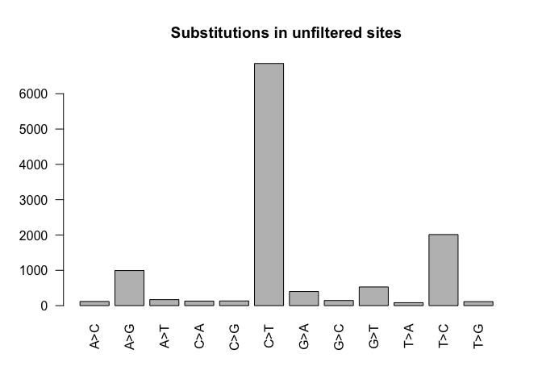
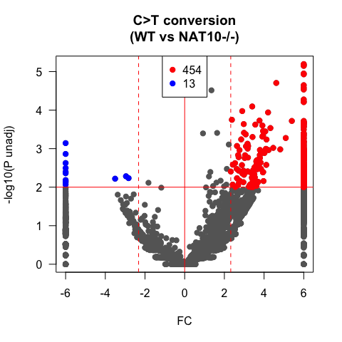
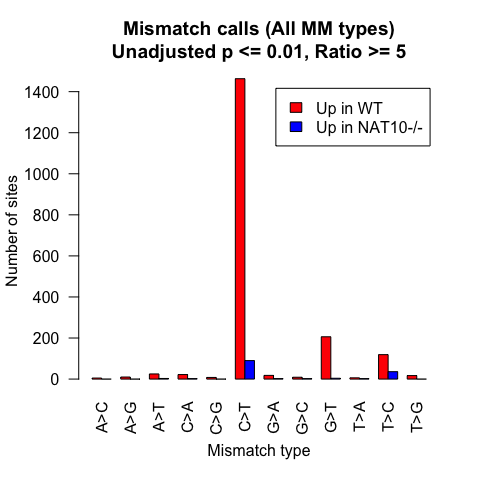

RedaC:T-Seq: Analysis example
================

``` r
####################################
# RedaC:T-Seq: Analysis example
#
# This code demonstrates data analysis on 
# RedaC:T-Seq pileup results
#
# Column order for the data:
####################################

# WT NaBH4
# KO NaBH4 (NAT10-/-)
# WT Untreated control

####################################
# Process all mismatches
####################################
pileup <- fread('sampledata/mpileup_output_chr19_min10_parsed.txt')
nrow(pileup)
```

    ## [1] 9215793

``` r
# Get mismatch percentages
All.ref <- data.frame(pileup, mis_WT_NaBH4=with(pileup, (Sub_0)/(depth_0)), mis_KO_NaBH4=with(pileup, (Sub_1)/(depth_1)), mis_WT_Ctrl=with(pileup, (Sub_2)/(depth_2)),mis_WT_Ctrl_total=with(pileup, ((depth_2) - (Ref_2))/(depth_2)))


#Get ratio between samples
All.ref <- data.frame(All.ref, WT_KO_NaBH4_ratio=with(All.ref, mis_WT_NaBH4/mis_KO_NaBH4), WT_WT_Ctrl_ratio=with(All.ref, mis_WT_NaBH4/mis_WT_Ctrl), KO_WT_NaBH4_ratio=with(All.ref, mis_KO_NaBH4/mis_WT_NaBH4))


#~~~~~~~~~~~~~~~~~~~~~~~~~~~~~~~~~~~~~~~~~~~~~~~
#~~~~~~~~~~~~~~~~~~~~~~~~~~~~~~~~~~~~~~~~~~~~~~~
# Apply some filters
#~~~~~~~~~~~~~~~~~~~~~~~~~~~~~~~~~~~~~~~~~~~~~~~
#~~~~~~~~~~~~~~~~~~~~~~~~~~~~~~~~~~~~~~~~~~~~~~~

# Depth at least 10 in WT AND KO AND Untreated
All.ref <- All.ref %>% filter(depth_0 >= 10 & depth_1 >= 10 & depth_2 >= 10)
dim(All.ref)
```

    ## [1] 9215793      20

``` r
#Filter coverage in Substitute  base for > 4 in either treated sample
All.ref <- All.ref %>% filter(Sub_0 >= 4 | Sub_1 >= 4)
dim(All.ref)
```

    ## [1] 73417    20

``` r
#Filter by mismatch fraction >= 1% in either treated sample
All.ref <- All.ref %>% filter(mis_WT_NaBH4 >= 0.01 | mis_KO_NaBH4 >= 0.01)
dim(All.ref)
```

    ## [1] 18802    20

``` r
head(All.ref)
```

    ##     chr   loc ref sub depth_0 Ref_0 Sub_0 depth_1 Ref_1 Sub_1 depth_2 Ref_2
    ## 1 chr19 60887   C   T      13     9     4      31    30     1      18    16
    ## 2 chr19 60930   C   T      28    26     2      44    38     6      22    20
    ## 3 chr19 60999   G   A      59    51     8      72    58    14     198   160
    ## 4 chr19 61001   G   A      59    54     5      72    69     3     197   180
    ## 5 chr19 61033   A   G      67    62     5      78    68    10     270   258
    ## 6 chr19 61040   A   G      68    50    18      85    70    15     282   264
    ##   Sub_2 mis_WT_NaBH4 mis_KO_NaBH4 mis_WT_Ctrl mis_WT_Ctrl_total
    ## 1     2   0.30769231   0.03225806  0.11111111        0.11111111
    ## 2     2   0.07142857   0.13636364  0.09090909        0.09090909
    ## 3    38   0.13559322   0.19444444  0.19191919        0.19191919
    ## 4    17   0.08474576   0.04166667  0.08629442        0.08629442
    ## 5    12   0.07462687   0.12820513  0.04444444        0.04444444
    ## 6    18   0.26470588   0.17647059  0.06382979        0.06382979
    ##   WT_KO_NaBH4_ratio WT_WT_Ctrl_ratio KO_WT_NaBH4_ratio
    ## 1         9.5384615        2.7692308         0.1048387
    ## 2         0.5238095        0.7857143         1.9090909
    ## 3         0.6973366        0.7065120         1.4340278
    ## 4         2.0338983        0.9820538         0.4916667
    ## 5         0.5820896        1.6791045         1.7179487
    ## 6         1.5000000        4.1470588         0.6666667

``` r
#~~~~~~~~~~~~~~~~~~~~~~~~~~~~~~~~~~~~~~~~~~~~~~~
#~~~~~~~~~~~~~~~~~~~~~~~~~~~~~~~~~~~~~~~~~~~~~~~
# Obtain ac4C candidate sites (in balanced fashion (KO and WT))
#~~~~~~~~~~~~~~~~~~~~~~~~~~~~~~~~~~~~~~~~~~~~~~~
#~~~~~~~~~~~~~~~~~~~~~~~~~~~~~~~~~~~~~~~~~~~~~~~

Combined.ref.allmm <- All.ref

#~~~~~~~~~~~~~~~~~~~~~~~~
# Append consistent identifiers
#~~~~~~~~~~~~~~~~~~~~~~~~

Combined.ref.allmm$locID <- paste0(Combined.ref.allmm$chr,":",Combined.ref.allmm$loc)
Combined.ref.allmm$subID <- paste0(Combined.ref.allmm$chr,":",Combined.ref.allmm$loc,":",Combined.ref.allmm$ref,">",Combined.ref.allmm$sub)

#~~~~~~~~~~~~~~~~~~~~~~~~
# Optional save point
#~~~~~~~~~~~~~~~~~~~~~~~~
```

# Map sites to transcripts

``` r
#~~~~~~~~~~~~~~~~~~~~~~~~~~~
# Put sites into BED format 
# Then re-load via genomation
#~~~~~~~~~~~~~~~~~~~~~~~~~~~

NaBH4sites <- Combined.ref.allmm
mybed <- data.frame(chr = NaBH4sites$chr,start = format(NaBH4sites$loc - 1,scientific=F) ,end = format(NaBH4sites$loc,scientific=F),id = NaBH4sites$subID,score = 1,strand = "*")
mybed$start <- str_trim(mybed$start, side = "both")
mybed$end <- str_trim(mybed$end, side = "both")
write.table(mybed,file="genomicsites.bed",col.names=F,quote=F,row.names=F,sep="\t")
mybed <- genomation::readBed("genomicsites.bed")
```

    ## Rows: 2 Columns: 6
    ## ── Column specification ────────────────────────────────────────────────────────
    ## Delimiter: "\t"
    ## chr (3): X1, X4, X6
    ## dbl (3): X2, X3, X5
    ## 
    ## ℹ Use `spec()` to retrieve the full column specification for this data.
    ## ℹ Specify the column types or set `show_col_types = FALSE` to quiet this message.

``` r
#~~~~~~~~~~~~~~~~~~~~~~
# Put transcript GTF into
# compatible objects
#~~~~~~~~~~~~~~~~~~~~~~

mytxcanon <- rtracklayer::import("sampledata/genes_chr19.gtf")
myTxDbcanon <- makeTxDbFromGRanges(mytxcanon)

exon_by_tx_canon <- exonsBy(myTxDbcanon, by="tx", use.names=TRUE)
mapped_exon_canon <- mapToTranscripts(mybed, exon_by_tx_canon,ignore.strand=FALSE)

#~~~~~~~~~~~~~~~~~~~~~~~~~
# Tabulate feature lengths
#~~~~~~~~~~~~~~~~~~~~~~~~

transcriptInfo <- transcriptLengths(myTxDbcanon, with.cds_len=TRUE,
                  with.utr5_len=TRUE, with.utr3_len=TRUE)


gr <-  mapped_exon_canon       
query.idx <- mcols(mapped_exon_canon)[,1] 
query.ids <- mcols(mybed)[,2]
query.sites <- query.ids[query.idx]
length(query.sites)
```

    ## [1] 12281

``` r
df <- data.frame(seqnames=seqnames(gr),
  starts=start(gr)-1,
  ends=end(gr),
  names=c(rep(".", length(gr))),
  scores=c(rep(".", length(gr))),
  strand=strand(gr),
  subID = query.sites)


#~~~~~~~~~~~~~~
# Adding annotation, feature location
#~~~~~~~~~~~~~~
        
df$txlength <- transcriptInfo$tx_len[match(df$seqnames,transcriptInfo$gene_id)]        
df$UTR5length <- transcriptInfo$utr5_len[match(df$seqnames,transcriptInfo$gene_id)]        
df$CDSlength <- transcriptInfo$cds_len[match(df$seqnames,transcriptInfo$gene_id)]        
df$UTR3length <- transcriptInfo$utr3_len[match(df$seqnames,transcriptInfo$gene_id)]        

myfeatures <- NULL
myfeatureposs <- NULL

for (i in 1:nrow(df)) {

        myrow <- df[i,]
        mypos <- myrow$starts
        if (myrow$CDSlength < 1) {
          myfeature = "none"
          myfeatures <- c(myfeatures,myfeature)
          myfeatureposs <- c(myfeatureposs,mypos)
        } else {
                    if (mypos <= myrow$UTR5length) { myfeature = "UTR5" }
                    if (mypos > myrow$UTR5length & mypos <= (myrow$UTR5length + myrow$CDSlength)) { myfeature = "CDS" }
                    if (mypos > (myrow$UTR5length + myrow$CDSlength)) { myfeature = "UTR3" }      
                    myfeatures <- c(myfeatures,myfeature)
                    if (myfeature == "UTR5") { myfeaturepos <- mypos }        
                    if (myfeature == "CDS") { myfeaturepos <- mypos - myrow$UTR5length }        
                    if (myfeature == "UTR3") { myfeaturepos <- mypos - myrow$UTR5length - myrow$CDSlength }           
                    myfeatureposs <- c(myfeatureposs,myfeaturepos)
                }
}
 
df$feature <- myfeatures
df$feature_pos <- myfeatureposs

table(df$feature)
```

    ## 
    ##  CDS none UTR3 UTR5 
    ## 7443  189 4053  596

``` r
prop.table(table(df$feature))
```

    ## 
    ##        CDS       none       UTR3       UTR5 
    ## 0.60605814 0.01538963 0.33002199 0.04853025

``` r
df$pos_rel_aTIS <- df$starts - df$UTR5length
df$pos_rel_aTIS[df$feature == "none"] <- NA
df$feature_pos[df$feature == "none"] <- NA

#~~~~~~~~~~~~~~~~
# Adjustment for strand
#~~~~~~~~~~~~~~~~~

NaBH4_join <- left_join(df,NaBH4sites,by="subID")

NaBH4_join$ref_strandcorrect <- NaBH4_join$ref
NaBH4_join$sub_strandcorrect <- NaBH4_join$sub

NaBH4_join$ref_strandcorrect[NaBH4_join$strand == "-" & NaBH4_join$ref == "C"] <- "G"
NaBH4_join$ref_strandcorrect[NaBH4_join$strand == "-" & NaBH4_join$ref == "G"] <- "C"
NaBH4_join$ref_strandcorrect[NaBH4_join$strand == "-" & NaBH4_join$ref == "A"] <- "T"
NaBH4_join$ref_strandcorrect[NaBH4_join$strand == "-" & NaBH4_join$ref == "T"] <- "A"

NaBH4_join$sub_strandcorrect[NaBH4_join$strand == "-" & NaBH4_join$sub == "C"] <- "G"
NaBH4_join$sub_strandcorrect[NaBH4_join$strand == "-" & NaBH4_join$sub == "G"] <- "C"
NaBH4_join$sub_strandcorrect[NaBH4_join$strand == "-" & NaBH4_join$sub == "A"] <- "T"
NaBH4_join$sub_strandcorrect[NaBH4_join$strand == "-" & NaBH4_join$sub == "T"] <- "A"

NaBH4_join$conversion <- paste0(NaBH4_join$ref_strandcorrect,">",NaBH4_join$sub_strandcorrect)

#~~~~~~~~~~~~~~~~~~~~~~~
# Find cases of ambiguous mapping
#~~~~~~~~~~~~~~~~~~~~~~

maptab <- table(NaBH4_join$subID)
ambiguous_map <- names(maptab[maptab > 1])
length(ambiguous_map)
```

    ## [1] 292

``` r
table(NaBH4_join$conversion[NaBH4_join$subID %in% ambiguous_map])
```

    ## 
    ## A>C A>G A>T C>A C>G C>T G>A G>C G>T T>A T>C T>G 
    ##   6  26   7  11   8 301 105   4  23   3  86   4

``` r
#~~~~~~~~~~~~~~~~~~~~~~~
# Find cases of multiple substitution types
#~~~~~~~~~~~~~~~~~~~~~~

testtab <- unique(NaBH4_join[,c("subID","locID")])
multiple_sub_tab <- table(testtab$locID)
multiple_subs <- names(multiple_sub_tab[multiple_sub_tab > 1])


#~~~~~~~~~~~~~~~~~~~~~~~
#~~~~~~~~~~~~~~~~~~~~~~~
# Filter ambiguous mapping or multiple substitutions
#~~~~~~~~~~~~~~~~~~~~~~
#~~~~~~~~~~~~~~~~~~~~~~~

NaBH4_join_filter <- NaBH4_join %>% filter(!(subID %in% ambiguous_map))
NaBH4_join_filter <- NaBH4_join_filter %>% filter(!(locID %in% multiple_subs))

# Checking conversions before filtering
barplot(table(NaBH4_join_filter$conversion),las=2,main="Substitutions in unfiltered sites")
```

<!-- -->

``` r
# Rename this object for the next step:
NaBH4_allmm_txmapped <- NaBH4_join_filter

#~~~~~~~~~~~~~~~~~~~~~~~~
# Optional save point
#~~~~~~~~~~~~~~~~~~~~~~~~
```

# Filter and get candidates

``` r
#~~~~~~~~~~~~~~~~~~~~~~~~~~~
#~~~~~~~~~~~~~~~~~~~~~~~~~~~~
# Get data for just 1.25%
#~~~~~~~~~~~~~~~~~~~~~~~~~~~
#~~~~~~~~~~~~~~~~~~~~~~~~~~~

#~~~~~~~~~~~~~~~~~~~~~~~~~~~
#~~~~~~~~~~~~~~~~~~~~~~~~~~~~
# Get candidates that pass comparison to untreated
#~~~~~~~~~~~~~~~~~~~~~~~~~~~
#~~~~~~~~~~~~~~~~~~~~~~~~~~~

#`````````````````````````````
# Increase minimum depth for comparison to untreated
# Coverage in Untreated >= 25
#`````````````````````````````

#mycandidates <- NaBH4_join_allmm_pool[NaBH4_join_allmm_pool$depth_2 >= 25 & !(is.na(NaBH4_join_allmm_pool$depth_2)),]

mycandidates <- NaBH4_allmm_txmapped

#~~~~~~~~~~~~~~
# Add more fields for diagnostics
#~~~~~~~~~~~~~~
mycandidates$diffMM <- mycandidates$mis_WT_NaBH4 - mycandidates$mis_KO_NaBH4
mycandidates$mean_NaBH4_depth <- (mycandidates$depth_0 + mycandidates$depth_1) / 2
mycandidates$max_NaBH4_MM <- apply(mycandidates[,c("mis_KO_NaBH4","mis_WT_NaBH4")],1,max)
mycandidates$Perc_max_MM_lost <- (mycandidates$max_NaBH4_MM - mycandidates$mis_WT_Ctrl)/mycandidates$max_NaBH4_MM

#`````````````````````````````
# 90% mismatches lost
# This is balanced for WT/KO - takes the maximum of either
#`````````````````````````````
prop.table(table(mycandidates$Perc_max_MM_lost > 0.90))
```

    ## 
    ##     FALSE      TRUE 
    ## 0.2394077 0.7605923

``` r
mycandidates <- mycandidates[mycandidates$Perc_max_MM_lost >= 0.9,]

#`````````````````````````````
# Total mismatches at this site < 1% in WT untreated
#`````````````````````````````
mycandidates <- mycandidates[mycandidates$mis_WT_Ctrl_total < 0.01 ,]

#~~~~~~~~~~~~~~~~~~~~~~~~~~
#~~~~~~~~~~~~~~~~~~~~~~~~~~
# Final selection for testing 
# Raising threshold to 1.25%
#~~~~~~~~~~~~~~~~~~~~~~~~~~
#~~~~~~~~~~~~~~~~~~~~~~~~~~

# Three sets here:
#1 Prefiltered (before anything is applied)
#2 Balanced (Applying the same threshold to WT and KO)
#3 1.25% in WT (As presented in the manuscript)

#prefiltered_candidates <- mycandidates

#~~~~~~~~~~~~~~~~~~~~~~~~~~~~~~~~~~
# Restrict to minimum 1.25% MM in either treated sample
#~~~~~~~~~~~~~~~~~~~~~~~~~~~~~~~~~~

balanced_candidates <- mycandidates[mycandidates$mis_WT_NaBH4 >= 0.0125 | mycandidates$mis_KO_NaBH4 >= 0.0125,]


#~~~~~~~~~~~~~~~~~~~~~~~~~~~~~~~~~~
#~~~~~~~~~~~~~~~~~~~~~~~~~~~~~~~~~~
# Perform FET
#~~~~~~~~~~~~~~~~~~~~~~~~~~~~~~~~~~
#~~~~~~~~~~~~~~~~~~~~~~~~~~~~~~~~~~

balanced_candidates$Fisher_WT_KO_BH4 = NA
for(i in 1:nrow(balanced_candidates)){
  balanced_candidates$Fisher_WT_KO_BH4[i] = fisher.test(matrix(c(balanced_candidates$Sub_0[i],balanced_candidates$Ref_0[i],balanced_candidates$Sub_1[i],balanced_candidates$Ref_1[i]), nrow=2))$p.value
}

#~~~~~~~~~~~~~~~~~~~~~~~~~~~~~~~~~~
# FDR correct
#~~~~~~~~~~~~~~~~~~~~~~~~~~~~~~~~~~

balanced_candidates$Fisher_WT_KO_BH4.adj <- p.adjust(balanced_candidates$Fisher_WT_KO_BH4,method="BH")
```

# Plot C\>T mismatches, unadj p-value \<= 0.01

``` r
candidates <- balanced_candidates

#~~~~~~~~~~~~~
# Set cutoffs
#~~~~~~~~~~~~

myp <- 0.01
myratio <- 5


  myconv <- "C>T"
  myset <- candidates[candidates$conversion %in% myconv,]
  
  
  myx <- log2(myset$WT_KO_NaBH4_ratio)
    myy <- -log10(myset$Fisher_WT_KO_BH4)
    # Set caps on x/y values for plotting
    myy[myy >= 10] <- 10
    myx[myx >= 6] <- 6
    myy[myy <= -10] <- -10
    myx[myx <= -6] <- -6

    # Get the significant sites for color coding
    mysig.wt <- myset[myset$Fisher_WT_KO_BH4 <= myp & myset$WT_KO_NaBH4_ratio >= myratio,]
    myx.wt <- log2(mysig.wt$WT_KO_NaBH4_ratio)
    myy.wt <- -log10(mysig.wt$Fisher_WT_KO_BH4)

    mysig.ko <- myset[myset$Fisher_WT_KO_BH4 <= myp & myset$WT_KO_NaBH4_ratio <= (1/myratio),]
    myx.ko <- log2(mysig.ko$WT_KO_NaBH4_ratio)
    myy.ko <- -log10(mysig.ko$Fisher_WT_KO_BH4)

    # Apply caps to significant sites for plotting (wt)
    myy.wt[myy.wt >= 10] <- 10
    myx.wt[myx.wt >= 6] <- 6
    myy.wt[myy.wt <= -10] <- -10
    myx.wt[myx.wt <= -6] <- -6
    # Apply caps to significant sites for plotting (ko)
    myy.ko[myy.ko >= 10] <- 10
    myx.ko[myx.ko >= 6] <- 6
    myy.ko[myy.ko <= -10] <- -10
    myx.ko[myx.ko <= -6] <- -6  

    #~~~~~~~~~~~~~~~~~~~~~
    # Volcano plot with color coding
    #~~~~~~~~~~~~~~~~~~~~~
    plot(myx,myy,main=paste0(myconv,
    " conversion\n(WT vs NAT10-/-)"),xlab="FC",ylab="-log10(P unadj)",col="grey40",las=1,xlim=c(-6,6),pch=19)
    points(myx.wt,myy.wt,col="red",pch=19)
    points(myx.ko,myy.ko,col="blue",pch=19)
    abline(v=0,col="red",lwd=1)
    abline(v=log2(myratio),col="red",lwd=1,lty=2)   
    abline(v=log2(1/myratio),col="red",lwd=1,lty=2) 
    abline(h=-log10(myp),col="red",lwd=1)   
    legend("top",c(as.character(length(myx.wt)),as.character(length(myx.ko))),pch=19,col=c("red","blue"))
```

<!-- -->

# Barplot of N values for significant sites

## (All mismatch types)

``` r
conv_tab <- table(balanced_candidates$conversion)
myconvs <- names(conv_tab)

myp <- 0.05
myratio <- 5

myset <- balanced_candidates
mysig.wt <- myset[myset$Fisher_WT_KO_BH4 <= myp & myset$WT_KO_NaBH4_ratio >= myratio,]
mysig.ko <- myset[myset$Fisher_WT_KO_BH4 <= myp & myset$WT_KO_NaBH4_ratio <= (1/myratio),]


tobar <- rbind(table(factor(mysig.wt$conversion,levels=myconvs)),
                     table(factor(mysig.ko$conversion,levels=myconvs)))
barplot(tobar,beside=T,col=c("red","blue"),las=1,main="Mismatch calls (All MM types)\nUnadjusted p <= 0.01, Ratio >= 5",legend.text = c("Up in WT","Up in NAT10-/-"),ylab="Number of sites",xlab="Mismatch type",las=2)
```

<!-- -->

# Session info

``` r
sessionInfo()
```

    ## R version 4.0.2 (2020-06-22)
    ## Platform: x86_64-apple-darwin17.0 (64-bit)
    ## Running under: macOS Catalina 10.15.7
    ## 
    ## Matrix products: default
    ## BLAS:   /Library/Frameworks/R.framework/Versions/4.0/Resources/lib/libRblas.dylib
    ## LAPACK: /Library/Frameworks/R.framework/Versions/4.0/Resources/lib/libRlapack.dylib
    ## 
    ## locale:
    ## [1] en_US.UTF-8/en_US.UTF-8/en_US.UTF-8/C/en_US.UTF-8/en_US.UTF-8
    ## 
    ## attached base packages:
    ##  [1] grid      parallel  stats4    stats     graphics  grDevices utils    
    ##  [8] datasets  methods   base     
    ## 
    ## other attached packages:
    ##  [1] stringr_1.4.0          genomation_1.20.0      GenomicFeatures_1.40.1
    ##  [4] AnnotationDbi_1.50.3   Biobase_2.48.0         rtracklayer_1.48.0    
    ##  [7] GenomicRanges_1.40.0   GenomeInfoDb_1.24.2    IRanges_2.22.2        
    ## [10] S4Vectors_0.26.1       BiocGenerics_0.34.0    dplyr_1.0.9           
    ## [13] data.table_1.14.2     
    ## 
    ## loaded via a namespace (and not attached):
    ##  [1] bitops_1.0-7                matrixStats_0.62.0         
    ##  [3] bit64_4.0.5                 progress_1.2.2             
    ##  [5] httr_1.4.3                  tools_4.0.2                
    ##  [7] utf8_1.2.2                  R6_2.5.1                   
    ##  [9] KernSmooth_2.23-20          DBI_1.1.3                  
    ## [11] colorspace_2.0-3            seqPattern_1.20.0          
    ## [13] tidyselect_1.1.2            prettyunits_1.1.1          
    ## [15] bit_4.0.4                   curl_4.3.2                 
    ## [17] compiler_4.0.2              cli_3.3.0                  
    ## [19] xml2_1.3.3                  DelayedArray_0.14.1        
    ## [21] scales_1.2.0                readr_2.1.2                
    ## [23] askpass_1.1                 rappdirs_0.3.3             
    ## [25] digest_0.6.29               Rsamtools_2.4.0            
    ## [27] rmarkdown_2.14              XVector_0.28.0             
    ## [29] pkgconfig_2.0.3             htmltools_0.5.3            
    ## [31] plotrix_3.8-2               dbplyr_2.2.1               
    ## [33] fastmap_1.1.0               BSgenome_1.56.0            
    ## [35] highr_0.9                   rlang_1.0.4                
    ## [37] rstudioapi_0.13             RSQLite_2.2.15             
    ## [39] impute_1.62.0               generics_0.1.3             
    ## [41] BiocParallel_1.22.0         vroom_1.5.7                
    ## [43] RCurl_1.98-1.8              magrittr_2.0.3             
    ## [45] GenomeInfoDbData_1.2.3      Matrix_1.4-1               
    ## [47] Rcpp_1.0.9                  munsell_0.5.0              
    ## [49] fansi_1.0.3                 lifecycle_1.0.1            
    ## [51] stringi_1.7.8               yaml_2.3.5                 
    ## [53] SummarizedExperiment_1.18.2 zlibbioc_1.34.0            
    ## [55] plyr_1.8.7                  BiocFileCache_1.12.1       
    ## [57] blob_1.2.3                  crayon_1.5.1               
    ## [59] lattice_0.20-45             Biostrings_2.56.0          
    ## [61] hms_1.1.1                   knitr_1.39                 
    ## [63] pillar_1.8.0                reshape2_1.4.4             
    ## [65] biomaRt_2.44.4              XML_3.99-0.10              
    ## [67] glue_1.6.2                  evaluate_0.16              
    ## [69] vctrs_0.4.1                 tzdb_0.3.0                 
    ## [71] gtable_0.3.0                openssl_2.0.2              
    ## [73] purrr_0.3.4                 assertthat_0.2.1           
    ## [75] cachem_1.0.6                ggplot2_3.3.6              
    ## [77] xfun_0.32                   gridBase_0.4-7             
    ## [79] tibble_3.1.8                GenomicAlignments_1.24.0   
    ## [81] memoise_2.0.1               ellipsis_0.3.2
